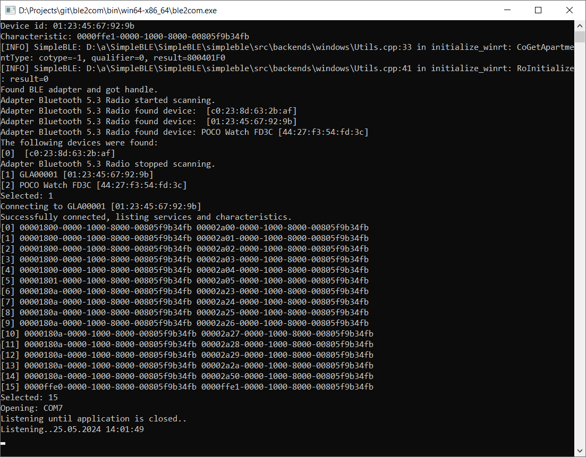

# ble2com

Reads BLE data and writes to COM-port so it can be readout as COM-port via virtual null-modem (one like https://sourceforge.net/projects/com0com/)

## Usage

Start application and select device and service to read from.
Also use bledevice.ini to specify COM-port. And you may set device and service to select and connect automatically.

bledevice.ini

    [BleDevice]
    scanTimeoutMs=10000
    deviceId=56:1e:04:0c:87:78
    characteristic=0000ffe1-0000-1000-8000-00805f9b34fb
    [ComPort]
    ;port=\\.\COM20
    port=CONSOLE

If application starts and finds device with deviceId and characteristic from config then application connects and starts reading data
and writing it to port. If config is absent or specified objects was not found application asks to select what to use.
When port=CONSOLE data read and is output to console only (it's mainly for some debug purpose).

### Releases

For direct downloads, check out [Releases](../../releases).

## Contributing

For simple bug reports and fixes, and feature requests, please simply use projects
[Issue Tracker](../../issues)

#### Third-party Dependencies

Pascal Bindings For SimpleBLE Library is Copyright (c) 2022 Erik Lins and released under the MIT License.
https://github.com/eriklins/Pascal-Bindings-For-SimpleBLE-Library

The SimpleBLE library is Copyright (c) 2021-2022 Kevin Dewald and released under the MIT License.
https://github.com/OpenBluetoothToolbox/SimpleBLE
